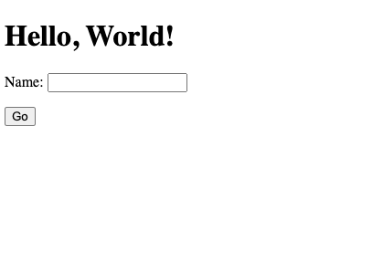
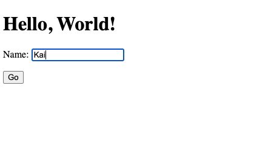
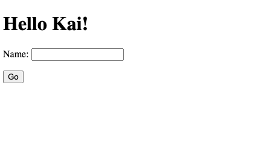
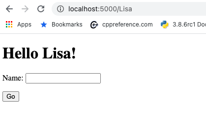

# CPSC 223p
##  Flask Hello World
Remember the book [Flask Web Development](https://csuf-primo.hosted.exlibrisgroup.com/permalink/f/43rjjt/TN_cdi_askewsholts_vlebooks_9781491991718) book by [Miguel Grinberg](https://blog.miguelgrinberg.com/) is available through the [CSUF library](http://www.library.fullerton.edu/). Miguel Grinberg has also written [the Flask Mega-Tutorial](https://blog.miguelgrinberg.com/post/the-flask-mega-tutorial-part-i-hello-world) for those unwilling to use books.

Write a web application using the Flask framework. The web application must be defined in a file named `hello.py`. The web application is a trivial hello world program. Loading the root level index page (/) of the application presents a page with the message "Hello World!" and a form with one field. The form prompts the web visitor to enter their name. Let's imagine the visitor's name is Kai. When the form is submitted the page re-renders with the message "Hello Kai!". The application will also say hello to anyone that vists the URL `/name` where name can be any string.

This project can be completed by reading and following the instructions given in the [Flask Quickstart](https://flask.palletsprojects.com/en/1.1.x/quickstart/) and making some small modifications.

One way to develop the application specified is to have one function named `hello_word()` which is mapped to two different routes, i.e. `app.route()`. The first route is for `/` and responds back with 'Hello World!'. The second route takes a parameter and handles both `GET` and `POST` requests. 

You're strongly encouraged to use [templates](https://jinja.palletsprojects.com/en/2.11.x/) however it is not required.

Don't forget that you need to set shell environment variables to control the behavior of the `flask` command. You need to set the `FLASK_APP` environment variable to the main file of your application. Additionally, please use the `FLASK_ENV` variable to have the demonstration web service in development mode which automatically reloads your application whenever you change a file. At the command line, the commands are:

"""
$ export FLASK_ENV=development
$ export FLASK_APP=hello.py
"""

You can use the `python-dotenv` module to automate environment variable loading and setting. For now, save your environment variables in a file named `bash_env.sh`. In this fashion, you can quickly load the environment variables by using the command `source bash_env.sh`.

## Example Output

